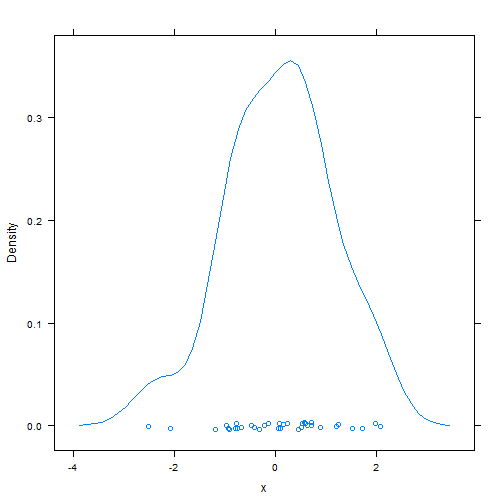
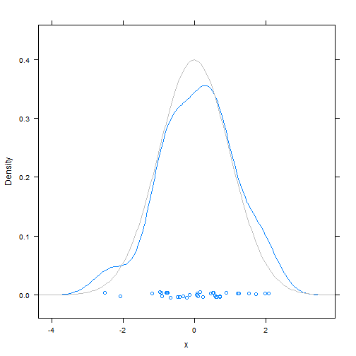
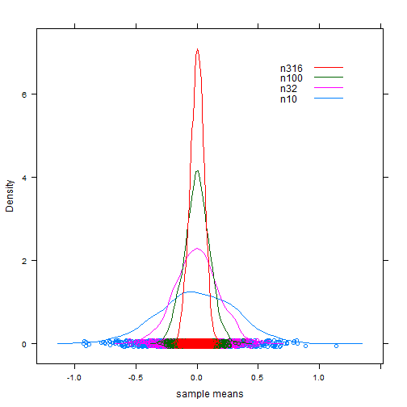

Seminar 02
========================================================


```r
n <- 100
B <- 4
x <- matrix(rnorm(n * B), nrow = n)
str(x)
```

```
##  num [1:100, 1:4] 0.113 -0.72 0.532 0.495 0.983 ...
```

```r
mean(apply(x, 2, mean))
```

```
## [1] 0.005585
```

```r
n <- 10000
B <- 4
x <- matrix(rnorm(n * B), nrow = n)
str(x)
```

```
##  num [1:10000, 1:4] -0.991 -0.206 -1.102 0.904 0.738 ...
```

```r
mean(apply(x, 2, mean))
```

```
## [1] -0.009942
```

```r
var(apply(x, 2, mean))
```

```
## [1] 6.28e-05
```

```r
var(x)
```

```
##            [,1]      [,2]       [,3]      [,4]
## [1,]  1.0087130  0.006625 -0.0007608  0.003364
## [2,]  0.0066254  0.996073  0.0073657 -0.007574
## [3,] -0.0007608  0.007366  1.0238299 -0.018916
## [4,]  0.0033643 -0.007574 -0.0189155  1.008278
```

```r
colMeans(x)
```

```
## [1] -0.014330 -0.013635 -0.013739  0.001936
```

```r
apply(x, 2, mean)
```

```
## [1] -0.014330 -0.013635 -0.013739  0.001936
```

```r
library(lattice)
n <- 35
x <- rnorm(n)
densityplot(~x)
```

 

```r
densityplot(~x, n = 200, ylim = dnorm(0) * c(-0.1, 1.15), panel = function(x, 
    ...) {
    panel.densityplot(x, ...)
    panel.mathdensity(n = 200, col.line = "grey74")
})
```

 

```r
B <- 1000
n <- round(10^(seq(from = 1, to = 2.5, length = 4)), 0)
names(n) <- paste0("n", n)
getSampleMeans <- function(n, B) colMeans(matrix(rnorm(n * B), nrow = n))
x <- data.frame(sapply(n, getSampleMeans, B))
jFormula <- as.formula(paste("~", paste(names(n), sep = "", collapse = " + ")))
densityplot(jFormula, x, xlab = "sample means", auto.key = list(x = 0.9, y = 0.9, 
    corner = c(1, 1), reverse.rows = TRUE))
```

 

```r
xTallSkinny <- stack(x)
names(xTallSkinny) <- c("x", "n")
xTallSkinny$n <- factor(xTallSkinny$n, levels = colnames(x))
densityplot(~x, xTallSkinny, xlab = "sample means", groups = n, auto.key = list(x = 0.9, 
    y = 0.9, corner = c(1, 1), reverse.rows = TRUE))
```

 


