Seminar 03
========================================================

```r
library(lattice)
kDat <- read.table("GSE4051_MINI.txt", header = TRUE, row.names = 1)
str(kDat)
```

```
## 'data.frame':	39 obs. of  6 variables:
##  $ sample    : int  20 21 22 23 16 17 6 24 25 26 ...
##  $ devStage  : Factor w/ 5 levels "4_weeks","E16",..: 2 2 2 2 2 2 2 4 4 4 ...
##  $ gType     : Factor w/ 2 levels "NrlKO","wt": 2 2 2 2 1 1 1 2 2 2 ...
##  $ crabHammer: num  10.22 10.02 9.64 9.65 8.58 ...
##  $ eggBomb   : num  7.46 6.89 6.72 6.53 6.47 ...
##  $ poisonFang: num  7.37 7.18 7.35 7.04 7.49 ...
```

```r
xyplot(eggBomb ~ crabHammer, kDat)
```

 

```r
xyplot(eggBomb + poisonFang ~ crabHammer, kDat, auto.key = TRUE)
```

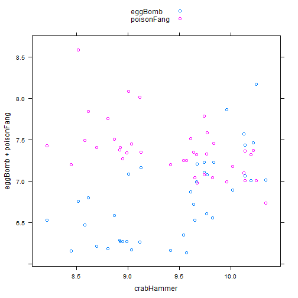 

```r
xyplot(eggBomb + poisonFang ~ crabHammer, kDat, outer = TRUE, grid = TRUE)
```

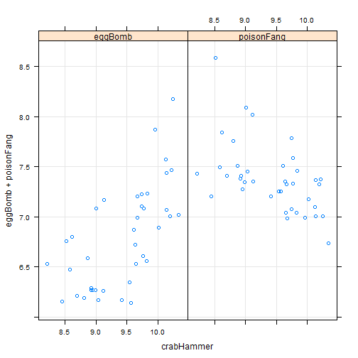 

```r
xyplot(eggBomb + poisonFang ~ crabHammer, kDat, outer = TRUE, grid = TRUE, groups = gType, 
    auto.key = TRUE)
```

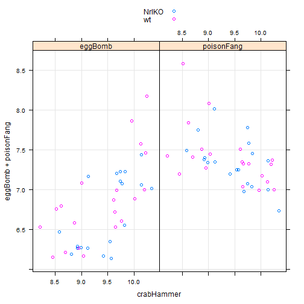 

```r
head(kDat)
```

```
##           sample devStage gType crabHammer eggBomb poisonFang
## Sample_20     20      E16    wt     10.220   7.462      7.370
## Sample_21     21      E16    wt     10.020   6.890      7.177
## Sample_22     22      E16    wt      9.642   6.720      7.350
## Sample_23     23      E16    wt      9.652   6.529      7.040
## Sample_16     16      E16 NrlKO      8.583   6.470      7.494
## Sample_17     17      E16 NrlKO     10.140   7.065      7.005
```

```r
kDat <- read.table("GSE4051_MINI.txt", header = TRUE, row.names = 1)
str(kDat)
```

```
## 'data.frame':	39 obs. of  6 variables:
##  $ sample    : int  20 21 22 23 16 17 6 24 25 26 ...
##  $ devStage  : Factor w/ 5 levels "4_weeks","E16",..: 2 2 2 2 2 2 2 4 4 4 ...
##  $ gType     : Factor w/ 2 levels "NrlKO","wt": 2 2 2 2 1 1 1 2 2 2 ...
##  $ crabHammer: num  10.22 10.02 9.64 9.65 8.58 ...
##  $ eggBomb   : num  7.46 6.89 6.72 6.53 6.47 ...
##  $ poisonFang: num  7.37 7.18 7.35 7.04 7.49 ...
```

```r
nDat <- with(kDat, data.frame(sample, devStage, gType, crabHammer, probset = factor(rep(c("eggBomb", 
    "poisonFang"), each = nrow(kDat))), geneExp = c(eggBomb, poisonFang)))
str(nDat)
```

```
## 'data.frame':	78 obs. of  6 variables:
##  $ sample    : int  20 21 22 23 16 17 6 24 25 26 ...
##  $ devStage  : Factor w/ 5 levels "4_weeks","E16",..: 2 2 2 2 2 2 2 4 4 4 ...
##  $ gType     : Factor w/ 2 levels "NrlKO","wt": 2 2 2 2 1 1 1 2 2 2 ...
##  $ crabHammer: num  10.22 10.02 9.64 9.65 8.58 ...
##  $ probset   : Factor w/ 2 levels "eggBomb","poisonFang": 1 1 1 1 1 1 1 1 1 1 ...
##  $ geneExp   : num  7.46 6.89 6.72 6.53 6.47 ...
```

```r
head(nDat)
```

```
##   sample devStage gType crabHammer probset geneExp
## 1     20      E16    wt     10.220 eggBomb   7.462
## 2     21      E16    wt     10.020 eggBomb   6.890
## 3     22      E16    wt      9.642 eggBomb   6.720
## 4     23      E16    wt      9.652 eggBomb   6.529
## 5     16      E16 NrlKO      8.583 eggBomb   6.470
## 6     17      E16 NrlKO     10.140 eggBomb   7.065
```

```r
tail(nDat)
```

```
##    sample devStage gType crabHammer    probset geneExp
## 73     38  4_weeks    wt      9.767 poisonFang   7.329
## 74     39  4_weeks    wt     10.200 poisonFang   7.320
## 75     11  4_weeks NrlKO      9.677 poisonFang   6.981
## 76     12  4_weeks NrlKO      9.129 poisonFang   7.350
## 77      2  4_weeks NrlKO      9.744 poisonFang   7.075
## 78      9  4_weeks NrlKO      9.822 poisonFang   7.043
```

```r
xyplot(geneExp ~ crabHammer | probset, nDat, grid = TRUE, groups = devStage, 
    auto.key = TRUE)
```

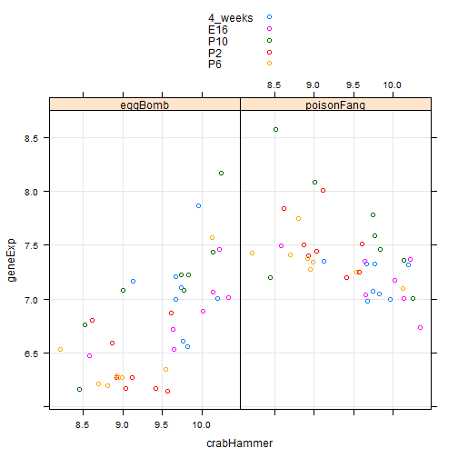 

```r
oDat <- with(kDat, data.frame(sample, devStage, gType, probeset = factor(rep(c("eggBomb", 
    "poisonFang", "crabHammer"), each = nrow(kDat))), geneExp = c(eggBomb, poisonFang, 
    crabHammer)))
str(oDat)
```

```
## 'data.frame':	117 obs. of  5 variables:
##  $ sample  : int  20 21 22 23 16 17 6 24 25 26 ...
##  $ devStage: Factor w/ 5 levels "4_weeks","E16",..: 2 2 2 2 2 2 2 4 4 4 ...
##  $ gType   : Factor w/ 2 levels "NrlKO","wt": 2 2 2 2 1 1 1 2 2 2 ...
##  $ probeset: Factor w/ 3 levels "crabHammer","eggBomb",..: 2 2 2 2 2 2 2 2 2 2 ...
##  $ geneExp : num  7.46 6.89 6.72 6.53 6.47 ...
```

```r
stripplot(~geneExp, oDat)
```

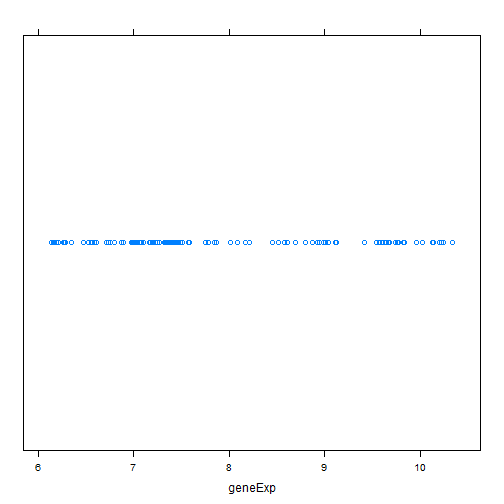 

```r
stripplot(probeset ~ geneExp, oDat, jitter.Data = TRUE)
```

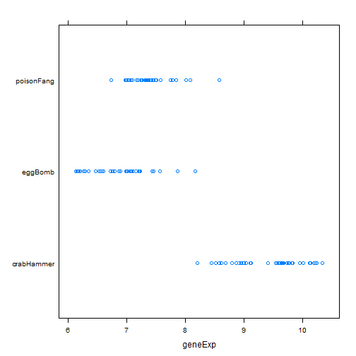 

```r
stripplot(~geneExp | probeset, oDat, layout = c(nlevels(oDat$probeset), 1))
```

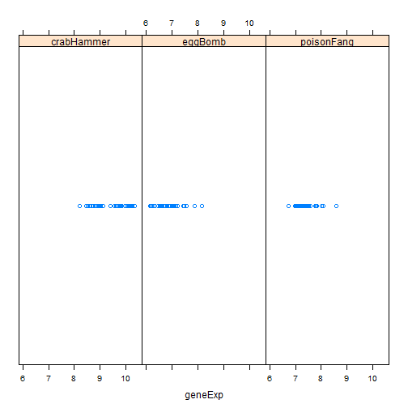 

```r
stripplot(geneExp ~ probeset, oDat)
```

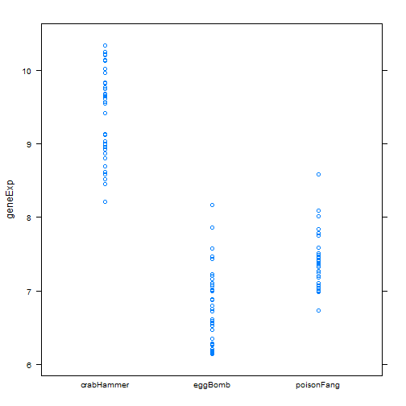 

```r
stripplot(probeset ~ geneExp | probeset, oDat)
```

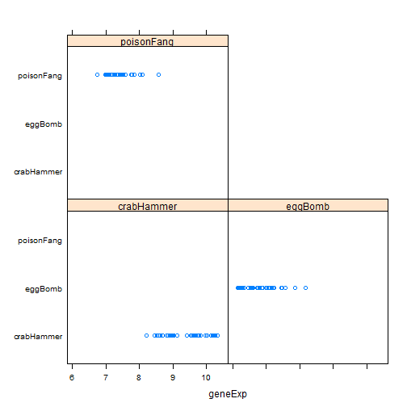 

```r
library(lattice)
bwplot(geneExp ~ devStage, oDat)
```

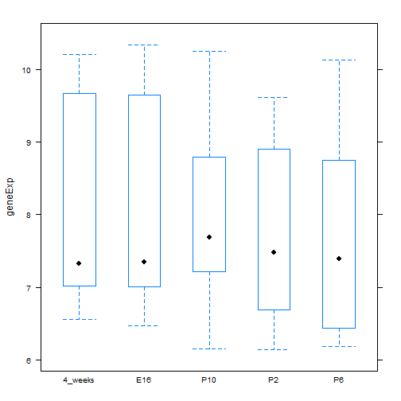 

```r
bwplot(geneExp ~ devStage | gType, oDat)
```

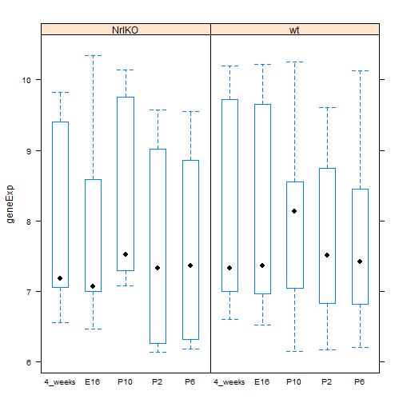 

```r
bwplot(geneExp ~ devStage, oDat, panel = panel.violin)
```

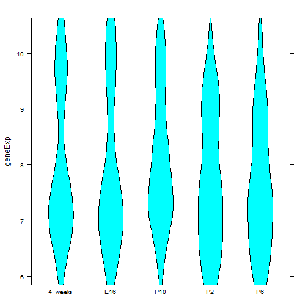 

```r
prDat <- read.table("https://github.com/jennybc/stat540_2014/blob/master/examples/photoRec/data/GSE4051_data.tsv")
```

```
## Warning: unsupported URL scheme
```

```
## Error: cannot open the connection
```

```r
str(prDat)
```

```
## Error: object 'prDat' not found
```

```r
prDat <- read.table("GSE4051_data.tsv")
str(prDat, max.level = 0)
```

```
## 'data.frame':	29949 obs. of  39 variables:
```

```r

```


