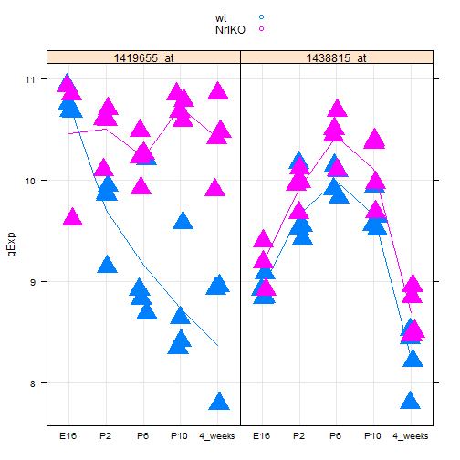
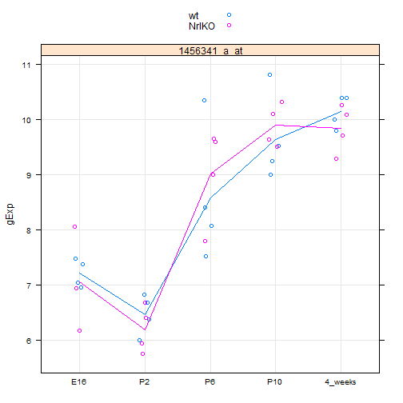
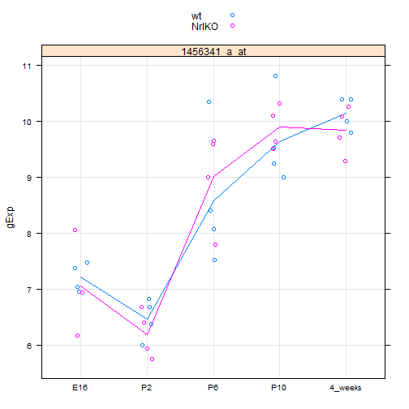
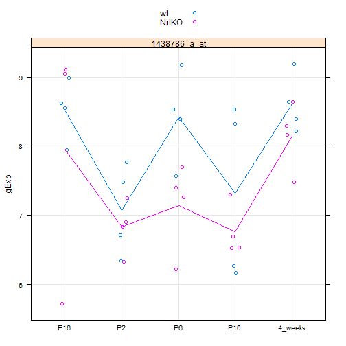
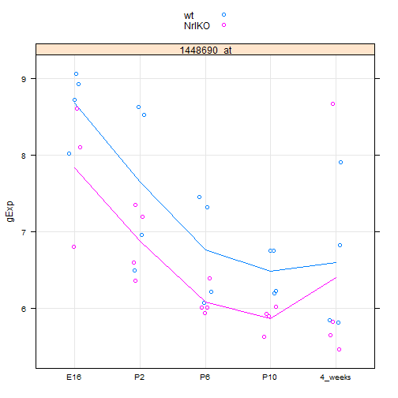

Seminar05
========================================================


```r
library(lattice)
prDat <- read.table("GSE4051_data.tsv", header = TRUE, row.names = 1)
str(prDat)
```

```
## 'data.frame':	29949 obs. of  39 variables:
##  $ Sample_20: num  7.24 9.48 10.01 8.36 8.59 ...
##  $ Sample_21: num  7.41 10.02 10.04 8.37 8.62 ...
##  $ Sample_22: num  7.17 9.85 9.91 8.4 8.52 ...
##  $ Sample_23: num  7.07 10.13 9.91 8.49 8.64 ...
##  $ Sample_16: num  7.38 7.64 8.42 8.36 8.51 ...
##  $ Sample_17: num  7.34 10.03 10.24 8.37 8.89 ...
##  $ Sample_6 : num  7.24 9.71 10.17 8.84 8.54 ...
##  $ Sample_24: num  7.11 9.75 9.39 8.37 8.36 ...
##  $ Sample_25: num  7.19 9.16 10.11 8.2 8.5 ...
##  $ Sample_26: num  7.18 9.49 9.41 8.73 8.39 ...
##  $ Sample_27: num  7.21 8.64 9.43 8.33 8.43 ...
##  $ Sample_14: num  7.09 9.56 9.88 8.57 8.59 ...
##  $ Sample_3 : num  7.16 9.55 9.84 8.33 8.5 ...
##  $ Sample_5 : num  7.08 9.32 9.24 8.3 8.48 ...
##  $ Sample_8 : num  7.11 8.24 9.13 8.13 8.33 ...
##  $ Sample_28: num  7.34 8.27 9.47 8.38 8.4 ...
##  $ Sample_29: num  7.66 10.03 9.88 8.56 8.69 ...
##  $ Sample_30: num  7.26 9.27 10.54 8.15 8.55 ...
##  $ Sample_31: num  7.31 9.26 10.1 8.37 8.49 ...
##  $ Sample_1 : num  7.15 9.87 9.68 8.28 8.5 ...
##  $ Sample_10: num  7.28 10.29 9.91 8.42 8.68 ...
##  $ Sample_4 : num  7.18 10.16 9.72 8.32 8.5 ...
##  $ Sample_7 : num  7.15 8.95 9.3 8.17 8.41 ...
##  $ Sample_32: num  7.54 9.53 9.92 8.78 8.57 ...
##  $ Sample_33: num  7.01 8.97 9.22 8.42 8.53 ...
##  $ Sample_34: num  6.81 8.83 9.39 8.1 8.32 ...
##  $ Sample_35: num  7.15 9.22 10.06 8.35 8.45 ...
##  $ Sample_13: num  7.33 9.33 9.75 8.43 8.48 ...
##  $ Sample_15: num  7.12 9.15 9.84 8.32 8.21 ...
##  $ Sample_18: num  7.21 9.49 10.03 8.55 8.5 ...
##  $ Sample_19: num  7.21 9.21 9.59 8.31 8.31 ...
##  $ Sample_36: num  7.25 9.66 9.51 8.49 8.42 ...
##  $ Sample_37: num  7.04 8.38 9.21 8.75 8.26 ...
##  $ Sample_38: num  7.37 9.44 9.48 8.49 8.34 ...
##  $ Sample_39: num  7.13 8.73 9.53 8.65 8.28 ...
##  $ Sample_11: num  7.42 9.83 10 8.6 8.43 ...
##  $ Sample_12: num  7.11 9.71 9.43 8.43 8.5 ...
##  $ Sample_2 : num  7.35 9.66 9.91 8.4 8.37 ...
##  $ Sample_9 : num  7.32 9.8 9.85 8.4 8.46 ...
```

```r
prDes <- readRDS("GSE4051_design.rds")
str(prDes)
```

```
## 'data.frame':	39 obs. of  4 variables:
##  $ sidChar : chr  "Sample_20" "Sample_21" "Sample_22" "Sample_23" ...
##  $ sidNum  : num  20 21 22 23 16 17 6 24 25 26 ...
##  $ devStage: Factor w/ 5 levels "E16","P2","P6",..: 1 1 1 1 1 1 1 2 2 2 ...
##  $ gType   : Factor w/ 2 levels "wt","NrlKO": 1 1 1 1 2 2 2 1 1 1 ...
```

```r
prepareData <- function(myGenes) {
    miniDat <- t(prDat[myGenes, ])
    miniDat <- suppressWarnings(data.frame(gExp = as.vector(miniDat), gene = rep(colnames(miniDat), 
        each = nrow(miniDat))))
    miniDat <- suppressWarnings(data.frame(prDes, miniDat))
    miniDat
}

(luckyGenes <- c("1419655_at", "1438815_at"))
```

```
## [1] "1419655_at" "1438815_at"
```

```r
jDat <- prepareData(luckyGenes)
str(jDat)
```

```
## 'data.frame':	78 obs. of  6 variables:
##  $ sidChar : chr  "Sample_20" "Sample_21" "Sample_22" "Sample_23" ...
##  $ sidNum  : num  20 21 22 23 16 17 6 24 25 26 ...
##  $ devStage: Factor w/ 5 levels "E16","P2","P6",..: 1 1 1 1 1 1 1 2 2 2 ...
##  $ gType   : Factor w/ 2 levels "wt","NrlKO": 1 1 1 1 2 2 2 1 1 1 ...
##  $ gExp    : num  10.93 10.74 10.67 10.68 9.61 ...
##  $ gene    : Factor w/ 2 levels "1419655_at","1438815_at": 1 1 1 1 1 1 1 1 1 1 ...
```

```r
head(jDat)
```

```
##     sidChar sidNum devStage gType   gExp       gene
## 1 Sample_20     20      E16    wt 10.930 1419655_at
## 2 Sample_21     21      E16    wt 10.740 1419655_at
## 3 Sample_22     22      E16    wt 10.670 1419655_at
## 4 Sample_23     23      E16    wt 10.680 1419655_at
## 5 Sample_16     16      E16 NrlKO  9.606 1419655_at
## 6 Sample_17     17      E16 NrlKO 10.840 1419655_at
```

```r
tail(jDat)
```

```
##      sidChar sidNum devStage gType  gExp       gene
## 73 Sample_38     38  4_weeks    wt 8.211 1438815_at
## 74 Sample_39     39  4_weeks    wt 8.436 1438815_at
## 75 Sample_11     11  4_weeks NrlKO 8.465 1438815_at
## 76 Sample_12     12  4_weeks NrlKO 8.841 1438815_at
## 77  Sample_2      2  4_weeks NrlKO 8.506 1438815_at
## 78  Sample_9      9  4_weeks NrlKO 8.952 1438815_at
```

```r
stripplot(gExp ~ devStage | gene, jDat, grou = gType, jitter.data = TRUE, auto.key = TRUE, 
    type = c("p", "a"), grid = TRUE, pch = 17, cex = 3)
```

 

```r
luckygenes <- ("1456341_a_at")
miniDat <- subset(prDat, rownames(prDat) %in% luckygenes)
str(miniDat)
```

```
## 'data.frame':	1 obs. of  39 variables:
##  $ Sample_20: num 7.04
##  $ Sample_21: num 7.48
##  $ Sample_22: num 7.37
##  $ Sample_23: num 6.94
##  $ Sample_16: num 6.16
##  $ Sample_17: num 6.93
##  $ Sample_6 : num 8.05
##  $ Sample_24: num 6.82
##  $ Sample_25: num 6.36
##  $ Sample_26: num 6.68
##  $ Sample_27: num 5.99
##  $ Sample_14: num 6.67
##  $ Sample_3 : num 5.93
##  $ Sample_5 : num 5.75
##  $ Sample_8 : num 6.4
##  $ Sample_28: num 7.51
##  $ Sample_29: num 10.3
##  $ Sample_30: num 8.4
##  $ Sample_31: num 8.07
##  $ Sample_1 : num 9
##  $ Sample_10: num 9.64
##  $ Sample_4 : num 9.58
##  $ Sample_7 : num 7.79
##  $ Sample_32: num 10.8
##  $ Sample_33: num 9.24
##  $ Sample_34: num 9
##  $ Sample_35: num 9.52
##  $ Sample_13: num 10.1
##  $ Sample_15: num 9.64
##  $ Sample_18: num 10.3
##  $ Sample_19: num 9.5
##  $ Sample_36: num 10.4
##  $ Sample_37: num 9.8
##  $ Sample_38: num 10.4
##  $ Sample_39: num 10
##  $ Sample_11: num 10.3
##  $ Sample_12: num 9.7
##  $ Sample_2 : num 10.1
##  $ Sample_9 : num 9.28
```

```r
miniDat <- data.frame(gExp = as.vector(t(as.matrix(miniDat))), gene = factor(rep(rownames(miniDat), 
    each = ncol(miniDat)), levels = luckygenes))
str(miniDat)
```

```
## 'data.frame':	39 obs. of  2 variables:
##  $ gExp: num  7.04 7.48 7.37 6.94 6.16 ...
##  $ gene: Factor w/ 1 level "1456341_a_at": 1 1 1 1 1 1 1 1 1 1 ...
```

```r
jDat <- suppressWarnings(data.frame(prDes, miniDat))
str(jDat)
```

```
## 'data.frame':	39 obs. of  6 variables:
##  $ sidChar : chr  "Sample_20" "Sample_21" "Sample_22" "Sample_23" ...
##  $ sidNum  : num  20 21 22 23 16 17 6 24 25 26 ...
##  $ devStage: Factor w/ 5 levels "E16","P2","P6",..: 1 1 1 1 1 1 1 2 2 2 ...
##  $ gType   : Factor w/ 2 levels "wt","NrlKO": 1 1 1 1 2 2 2 1 1 1 ...
##  $ gExp    : num  7.04 7.48 7.37 6.94 6.16 ...
##  $ gene    : Factor w/ 1 level "1456341_a_at": 1 1 1 1 1 1 1 1 1 1 ...
```

```r
stripplot(gExp ~ devStage | gene, jDat, group = gType, jitter.data = TRUE, auto.key = TRUE, 
    type = c("p", "a"), grid = TRUE)
```

 

```r
str(jDat)
```

```
## 'data.frame':	39 obs. of  6 variables:
##  $ sidChar : chr  "Sample_20" "Sample_21" "Sample_22" "Sample_23" ...
##  $ sidNum  : num  20 21 22 23 16 17 6 24 25 26 ...
##  $ devStage: Factor w/ 5 levels "E16","P2","P6",..: 1 1 1 1 1 1 1 2 2 2 ...
##  $ gType   : Factor w/ 2 levels "wt","NrlKO": 1 1 1 1 2 2 2 1 1 1 ...
##  $ gExp    : num  7.04 7.48 7.37 6.94 6.16 ...
##  $ gene    : Factor w/ 1 level "1456341_a_at": 1 1 1 1 1 1 1 1 1 1 ...
```

```r
head(jDat)
```

```
##      sidChar sidNum devStage gType  gExp         gene
## 12 Sample_20     20      E16    wt 7.044 1456341_a_at
## 13 Sample_21     21      E16    wt 7.478 1456341_a_at
## 14 Sample_22     22      E16    wt 7.374 1456341_a_at
## 15 Sample_23     23      E16    wt 6.944 1456341_a_at
## 9  Sample_16     16      E16 NrlKO 6.161 1456341_a_at
## 10 Sample_17     17      E16 NrlKO 6.931 1456341_a_at
```

```r
ttestDat <- subset(jDat, devStage %in% c("P2", "4_weeks"))
str(ttestDat)
```

```
## 'data.frame':	16 obs. of  6 variables:
##  $ sidChar : chr  "Sample_24" "Sample_25" "Sample_26" "Sample_27" ...
##  $ sidNum  : num  24 25 26 27 14 3 5 8 36 37 ...
##  $ devStage: Factor w/ 5 levels "E16","P2","P6",..: 2 2 2 2 2 2 2 2 5 5 ...
##  $ gType   : Factor w/ 2 levels "wt","NrlKO": 1 1 1 1 2 2 2 2 1 1 ...
##  $ gExp    : num  6.82 6.36 6.68 5.99 6.67 ...
##  $ gene    : Factor w/ 1 level "1456341_a_at": 1 1 1 1 1 1 1 1 1 1 ...
```

```r
t.test(gExp ~ devStage, ttestDat)
```

```
## 
## 	Welch Two Sample t-test
## 
## data:  gExp by devStage
## t = -18.84, df = 13.98, p-value = 2.477e-11
## alternative hypothesis: true difference in means is not equal to 0
## 95 percent confidence interval:
##  -4.078 -3.244
## sample estimates:
##      mean in group P2 mean in group 4_weeks 
##                 6.326                 9.987
```

```r
stripplot(gExp ~ devStage | gene, jDat, group = gType, jitter.data = TRUE, auto.key = TRUE, 
    type = c("p", "a"), grid = TRUE)
```

 

```r
luckygenes <- ("1438786_a_at")
miniDat <- subset(prDat, rownames(prDat) %in% luckygenes)
miniDat <- data.frame(gExp = as.vector(t(as.matrix(miniDat))), gene = factor(rep(rownames(miniDat), 
    each = ncol(miniDat)), levels = luckygenes))
new2Dat <- suppressWarnings(data.frame(prDes, miniDat))
str(new2Dat)
```

```
## 'data.frame':	39 obs. of  6 variables:
##  $ sidChar : chr  "Sample_20" "Sample_21" "Sample_22" "Sample_23" ...
##  $ sidNum  : num  20 21 22 23 16 17 6 24 25 26 ...
##  $ devStage: Factor w/ 5 levels "E16","P2","P6",..: 1 1 1 1 1 1 1 2 2 2 ...
##  $ gType   : Factor w/ 2 levels "wt","NrlKO": 1 1 1 1 2 2 2 1 1 1 ...
##  $ gExp    : num  7.94 8.99 8.55 8.62 5.72 ...
##  $ gene    : Factor w/ 1 level "1438786_a_at": 1 1 1 1 1 1 1 1 1 1 ...
```

```r
stripplot(gExp ~ devStage | gene, new2Dat, group = gType, jitter.data = TRUE, 
    auto.key = TRUE, type = c("p", "a"), grid = TRUE)
```

 

```r
lmFit <- lm(gExp ~ devStage, mDat, subset = gType == "wt")
```

```
## Error: object 'mDat' not found
```

```r
summary(lmFit)
```

```
## Error: object 'lmFit' not found
```

```r
coef(lmFit)
```

```
## Error: object 'lmFit' not found
```

```r
contMat <- matrix(c(0, 1, 0, -1, 0), nrow = 1)
obsDiff <- contMat %*% coef(lmFit)
```

```
## Error: object 'lmFit' not found
```

```r
estSe <- contMat %*% vcov(lmFit) %*% t(contMat)
```

```
## Error: object 'lmFit' not found
```

```r
estSe
```

```
## Error: object 'estSe' not found
```

```r
testStat <- obsDiff/estSe
```

```
## Error: object 'obsDiff' not found
```

```r
testStat
```

```
## Error: object 'testStat' not found
```

```r
2 * pt(abs(testStat), df = df.residual(lmFit), lower.tail = FALSE)
```

```
## Error: object 'testStat' not found
```

```r
prepareData <- function(myGenes) {
    miniDat <- t(prDat[myGenes, ])
    miniDat <- suppressWarnings(data.frame(gExp = as.vector(miniDat), gene = rep(colnames(miniDat), 
        each = nrow(miniDat))))
    miniDat <- suppressWarnings(data.frame(prDes, miniDat))
    miniDat
}
makeStripplot <- function(myData, ...) {
    stripplot(gExp ~ devStage | gene, myData, group = gType, jitter.data = TRUE, 
        auto.key = TRUE, type = c("p", "a"), grid = TRUE, ...)
}
oDat <- prepareData("1448690_at")
str(oDat)
```

```
## 'data.frame':	39 obs. of  6 variables:
##  $ sidChar : chr  "Sample_20" "Sample_21" "Sample_22" "Sample_23" ...
##  $ sidNum  : num  20 21 22 23 16 17 6 24 25 26 ...
##  $ devStage: Factor w/ 5 levels "E16","P2","P6",..: 1 1 1 1 1 1 1 2 2 2 ...
##  $ gType   : Factor w/ 2 levels "wt","NrlKO": 1 1 1 1 2 2 2 1 1 1 ...
##  $ gExp    : num  8.02 9.05 8.71 8.92 6.8 ...
##  $ gene    : Factor w/ 1 level "1448690_at": 1 1 1 1 1 1 1 1 1 1 ...
```

```r
makeStripplot(oDat)
```

 

```r
oFitBig <- lm(gExp ~ gType * devStage, oDat)
summary(oFitBig)$coef
```

```
##                            Estimate Std. Error  t value  Pr(>|t|)
## (Intercept)                 8.67800     0.3987 21.76755 1.634e-19
## gTypeNrlKO                 -0.84233     0.6090 -1.38320 1.772e-01
## devStageP2                 -1.02900     0.5638 -1.82512 7.830e-02
## devStageP6                 -1.91450     0.5638 -3.39571 2.003e-03
## devStageP10                -2.19325     0.5638 -3.89012 5.387e-04
## devStage4_weeks            -2.08200     0.5638 -3.69280 9.149e-04
## gTypeNrlKO:devStageP2       0.06983     0.8299  0.08415 9.335e-01
## gTypeNrlKO:devStageP6       0.16533     0.8299  0.19922 8.435e-01
## gTypeNrlKO:devStageP10      0.22583     0.8299  0.27212 7.875e-01
## gTypeNrlKO:devStage4_weeks  0.64608     0.8299  0.77852 4.426e-01
```

```r
oFitSmall <- lm(gExp ~ gType + devStage, oDat)
summary(oFitSmall)$coef
```

```
##                 Estimate Std. Error t value  Pr(>|t|)
## (Intercept)       8.5803     0.3046  28.165 1.177e-24
## gTypeNrlKO       -0.6144     0.2430  -2.528 1.643e-02
## devStageP2       -1.0104     0.3924  -2.575 1.470e-02
## devStageP6       -1.8481     0.3924  -4.710 4.328e-05
## devStageP10      -2.0966     0.3924  -5.343 6.703e-06
## devStage4_weeks  -1.7752     0.3924  -4.524 7.444e-05
```

```r
anova(oFitBig, oFitSmall)
```

```
## Analysis of Variance Table
## 
## Model 1: gExp ~ gType * devStage
## Model 2: gExp ~ gType + devStage
##   Res.Df  RSS Df Sum of Sq   F Pr(>F)
## 1     29 18.4                        
## 2     33 18.9 -4    -0.497 0.2   0.94
```

```r

```


