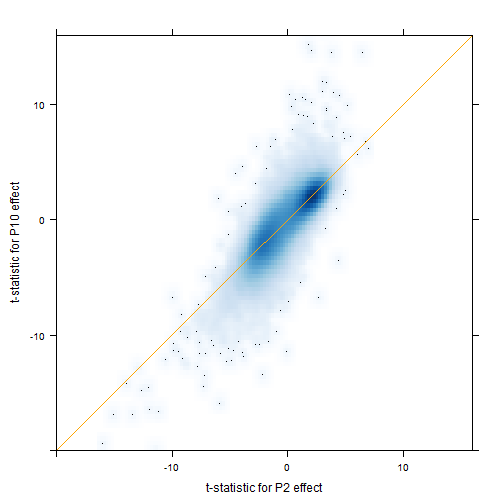

Seminar06
========================================================

```r
library(limma)
library(lattice)
prData <- read.table("GSE4051_data.tsv", header = TRUE, row.names = 1)
str(prData, max.level = 0)
```

```
## 'data.frame':	29949 obs. of  39 variables:
```

```r
prDes <- readRDS("GSE4051_design.rds")
str(prDes)
```

```
## 'data.frame':	39 obs. of  4 variables:
##  $ sidChar : chr  "Sample_20" "Sample_21" "Sample_22" "Sample_23" ...
##  $ sidNum  : num  20 21 22 23 16 17 6 24 25 26 ...
##  $ devStage: Factor w/ 5 levels "E16","P2","P6",..: 1 1 1 1 1 1 1 2 2 2 ...
##  $ gType   : Factor w/ 2 levels "wt","NrlKO": 1 1 1 1 2 2 2 1 1 1 ...
```

```r
prepareData <- function(myGenes) {
    miniDat <- t(prDat[myGenes, ])
    miniDat <- suppressWarnings(data.frame(gExp = as.vector(miniDat), gene = rep(colnames(miniDat), 
        each = nrow(miniDat))))
    miniDat <- suppressWarnings(data.frame(prDes, miniDat))
    miniDat
}
makeStripplot <- function(myData, ...) {
    stripplot(gExp ~ devStage | gene, myData, group = gType, jitter.data = TRUE, 
        auto.key = TRUE, type = c("p", "a"), grid = TRUE, ...)
}
wtDes <- subset(prDes, gType == "wt")
str(wtDes)
```

```
## 'data.frame':	20 obs. of  4 variables:
##  $ sidChar : chr  "Sample_20" "Sample_21" "Sample_22" "Sample_23" ...
##  $ sidNum  : num  20 21 22 23 24 25 26 27 28 29 ...
##  $ devStage: Factor w/ 5 levels "E16","P2","P6",..: 1 1 1 1 2 2 2 2 3 3 ...
##  $ gType   : Factor w/ 2 levels "wt","NrlKO": 1 1 1 1 1 1 1 1 1 1 ...
```

```r
wtDat <- subset(prData, select = prDes$gType == "wt")
str(wtDat, max.level = 0)
```

```
## 'data.frame':	29949 obs. of  20 variables:
```

```r
wtDesMat <- model.matrix(~devStage, wtDes)
str(wtDesMat)
```

```
##  num [1:20, 1:5] 1 1 1 1 1 1 1 1 1 1 ...
##  - attr(*, "dimnames")=List of 2
##   ..$ : chr [1:20] "12" "13" "14" "15" ...
##   ..$ : chr [1:5] "(Intercept)" "devStageP2" "devStageP6" "devStageP10" ...
##  - attr(*, "assign")= int [1:5] 0 1 1 1 1
##  - attr(*, "contrasts")=List of 1
##   ..$ devStage: chr "contr.treatment"
```

```r
head(wtDesMat)
```

```
##    (Intercept) devStageP2 devStageP6 devStageP10 devStage4_weeks
## 12           1          0          0           0               0
## 13           1          0          0           0               0
## 14           1          0          0           0               0
## 15           1          0          0           0               0
## 28           1          1          0           0               0
## 29           1          1          0           0               0
```

```r
wtFit <- lmFit(wtDat, wtDesMat)
wtEbFit <- eBayes(wtFit)
topTable(wtEbFit)
```

```
##              X.Intercept. devStageP2 devStageP6 devStageP10
## 1423641_s_at        12.18    -0.0175     0.0750      0.0675
## 1438940_x_at        12.86     0.0850     0.1325      0.3425
## 1438657_x_at        12.78     0.1400     0.1250     -0.1850
## 1456736_x_at        12.32     0.1625     0.3050      0.2075
## 1436884_x_at        12.93     0.1775     0.3225      0.0300
## 1419700_a_at        12.32     0.1650     0.6475      0.8175
## 1435800_a_at        12.28     0.0450     0.6825      0.9000
## 1454613_at          12.47    -0.1075    -0.0500     -0.1025
## 1451240_a_at        13.00     0.3100     0.2800      0.2800
## 1450084_s_at        12.63     0.0825     0.0525      0.1725
##              devStage4_weeks AveExpr     F   P.Value adj.P.Val
## 1423641_s_at          0.1800   12.24 45350 3.574e-36 5.201e-32
## 1438940_x_at          0.3500   13.04 44957 3.865e-36 5.201e-32
## 1438657_x_at         -0.4500   12.71 43486 5.210e-36 5.201e-32
## 1456736_x_at          0.0725   12.47 39509 1.233e-35 6.725e-32
## 1436884_x_at          0.0250   13.04 39269 1.302e-35 6.725e-32
## 1419700_a_at          0.6825   12.78 39121 1.347e-35 6.725e-32
## 1435800_a_at          1.0200   12.81 36668 2.410e-35 1.031e-31
## 1454613_at           -0.3825   12.34 35835 2.962e-35 1.078e-31
## 1451240_a_at         -0.3700   13.10 35481 3.239e-35 1.078e-31
## 1450084_s_at          0.2600   12.75 34411 4.265e-35 1.234e-31
```

```r
dsHits <- topTable(wtEbFit, coef = grep("devStage", colnames(coef(wtEbFit))))
cutoff <- 1e-05
dsHits <- topTable(wtEbFit, coef = grep("devStage", colnames(coef(wtEbFit))), 
    p.value = cutoff, n = Inf)
numBHhits <- nrow(dsHits)
dsHits <- topTable(wtEbFit, p.value = cutoff, n = Inf)
numBHhits <- nrow(dsHits)
numBHhits
```

```
## [1] 29949
```

```r
dsHits[63, c("F", "adj.P.Val", "devStageP6")]
```

```
##                  F adj.P.Val devStageP6
## 1440818_s_at 20773 1.886e-30     0.0975
```

```r
P2Hits <- topTable(wtEbFit, coef = "devStageP2", n = Inf, sort = "none")
head(P2Hits)
```

```
##                 logFC AveExpr         t P.Value adj.P.Val      B
## 1415670_at   -0.04825   7.223 -0.345007 0.73410    0.7916 -6.273
## 1415671_at   -0.61300   9.305 -1.828652 0.08410    0.1685 -4.769
## 1415672_at   -0.38175   9.727 -1.747589 0.09761    0.1838 -4.894
## 1415673_at   -0.00025   8.438 -0.001767 0.99861    0.9992 -6.333
## 1415674_a_at -0.16950   8.467 -1.868422 0.07810    0.1611 -4.706
## 1415675_at    0.02875   9.612  0.269338 0.79074    0.8390 -6.296
```

```r
P10Hits <- topTable(wtEbFit, coef = "devStageP10", n = Inf, sort = "none")
head(P10Hits)
```

```
##                 logFC AveExpr        t P.Value adj.P.Val      B
## 1415670_at   -0.09275   7.223 -0.66320  0.5156    0.6027 -6.549
## 1415671_at   -0.73400   9.305 -2.18961  0.0420    0.1056 -4.564
## 1415672_at   -0.32000   9.727 -1.46491  0.1602    0.2498 -5.719
## 1415673_at    0.00600   8.438  0.04242  0.9666    0.9742 -6.774
## 1415674_a_at -0.12325   8.467 -1.35860  0.1911    0.2839 -5.860
## 1415675_at   -0.13675   9.612 -1.28111  0.2164    0.3112 -5.957
```

```r
xyplot(P10Hits$t ~ P2Hits$t, aspect = 1, xlab = "t-statistic for P2 effect", 
    ylab = "t-statistic for P10 effect", xlim = c(-20, 16), ylim = c(-20, 16), 
    panel = function(x, y, ...) {
        panel.smoothScatter(x, y, nbin = 100, ...)
        panel.abline(a = 0, b = 1, col = "orange")
    })
```

```
## KernSmooth 2.23 loaded
## Copyright M. P. Wand 1997-2009
## (loaded the KernSmooth namespace)
```

 


