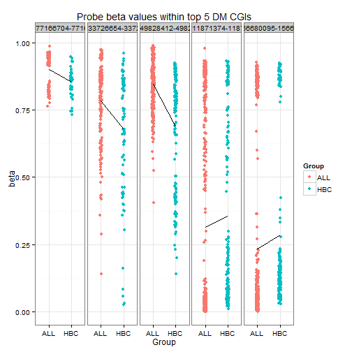

Seminar08
========================================================


```r
library(lattice)
library(GEOquery)
```

```
## Loading required package: Biobase
## Loading required package: BiocGenerics
## Loading required package: parallel
## 
## Attaching package: 'BiocGenerics'
## 
## The following objects are masked from 'package:parallel':
## 
##     clusterApply, clusterApplyLB, clusterCall, clusterEvalQ,
##     clusterExport, clusterMap, parApply, parCapply, parLapply,
##     parLapplyLB, parRapply, parSapply, parSapplyLB
## 
## The following object is masked from 'package:stats':
## 
##     xtabs
## 
## The following objects are masked from 'package:base':
## 
##     anyDuplicated, append, as.data.frame, as.vector, cbind,
##     colnames, duplicated, eval, evalq, Filter, Find, get,
##     intersect, is.unsorted, lapply, Map, mapply, match, mget,
##     order, paste, pmax, pmax.int, pmin, pmin.int, Position, rank,
##     rbind, Reduce, rep.int, rownames, sapply, setdiff, sort,
##     table, tapply, union, unique, unlist
## 
## Welcome to Bioconductor
## 
##     Vignettes contain introductory material; view with
##     'browseVignettes()'. To cite Bioconductor, see
##     'citation("Biobase")', and for packages 'citation("pkgname")'.
## 
## Setting options('download.file.method.GEOquery'='auto')
```

```r
library(wateRmelon)
```

```
## Loading required package: limma
## 
## Attaching package: 'limma'
## 
## The following object is masked from 'package:BiocGenerics':
## 
##     plotMA
## 
## Loading required package: matrixStats
## matrixStats v0.8.14 (2013-11-23) successfully loaded. See ?matrixStats for help.
## 
## Attaching package: 'matrixStats'
## 
## The following objects are masked from 'package:Biobase':
## 
##     anyMissing, rowMedians
## 
## Loading required package: methylumi
## Loading required package: scales
```

```
## Warning: package 'scales' was built under R version 3.0.3
```

```
## Loading required package: reshape2
```

```
## Warning: package 'reshape2' was built under R version 3.0.3
```

```
## Loading required package: ggplot2
```

```
## Warning: package 'ggplot2' was built under R version 3.0.3
## Warning: replacing previous import by 'graphics::image' when loading 'methylumi'
```

```
## Loading required package: lumi
## KernSmooth 2.23 loaded
## Copyright M. P. Wand 1997-2009
```

```
## Warning: replacing previous import by 'nleqslv::nleqslv' when loading
## 'lumi'
```

```
## 
## Attaching package: 'lumi'
## 
## The following objects are masked from 'package:methylumi':
## 
##     estimateM, getHistory
## 
## Loading required package: IlluminaHumanMethylation450k.db
## Loading required package: AnnotationDbi
## Loading required package: org.Hs.eg.db
## Loading required package: DBI
```

```
## Warning: 'IlluminaHumanMethylation450k.db' is deprecated.
## Use 'FDb.InfiniumMethylation.hg19' instead.
## Use 'FDb.InfiniumMethylation.hg18' instead.
## Use 'mapToGenome() function in minfi or methylumi' instead.
## See help("Deprecated")
```

```
## Loading required package: ROC
```

```r
library(IlluminaHumanMethylation450k.db)
library(ggplot2)
library(limma)
library(gplots)
```

```
## Warning: package 'gplots' was built under R version 3.0.3
```

```
## 
## Attaching package: 'gplots'
## 
## The following object is masked from 'package:stats':
## 
##     lowess
```

```r

GSE39141 <- getGEO("GSE39141")
```

```
## Found 1 file(s)
## GSE39141_series_matrix.txt.gz
## File stored at: 
## C:\Users\PAN&WA~1\AppData\Local\Temp\RtmpMj3UWL/GPL13534.soft
```

```r
show(GSE39141)
```

```
## $GSE39141_series_matrix.txt.gz
## ExpressionSet (storageMode: lockedEnvironment)
## assayData: 485577 features, 33 samples 
##   element names: exprs 
## protocolData: none
## phenoData
##   sampleNames: GSM956761 GSM956762 ... GSM956793 (33 total)
##   varLabels: title geo_accession ... data_row_count (38 total)
##   varMetadata: labelDescription
## featureData
##   featureNames: cg00000029 cg00000108 ... rs9839873 (485577 total)
##   fvarLabels: ID Name ... SPOT_ID (37 total)
##   fvarMetadata: Column Description labelDescription
## experimentData: use 'experimentData(object)'
## Annotation: GPL13534
```

```r
GSE42865 <- getGEO("GSE42865")
```

```
## Found 1 file(s)
## GSE42865_series_matrix.txt.gz
## Using locally cached version of GPL13534 found here:
## C:\Users\PAN&WA~1\AppData\Local\Temp\RtmpMj3UWL/GPL13534.soft
```

```r
show(GSE42865)
```

```
## $GSE42865_series_matrix.txt.gz
## ExpressionSet (storageMode: lockedEnvironment)
## assayData: 485577 features, 16 samples 
##   element names: exprs 
## protocolData: none
## phenoData
##   sampleNames: GSM1052413 GSM1052414 ... GSM1052428 (16 total)
##   varLabels: title geo_accession ... data_row_count (34 total)
##   varMetadata: labelDescription
## featureData
##   featureNames: cg00000029 cg00000108 ... rs9839873 (485577 total)
##   fvarLabels: ID Name ... SPOT_ID (37 total)
##   fvarMetadata: Column Description labelDescription
## experimentData: use 'experimentData(object)'
## Annotation: GPL13534
```

```r
ALL.dat <- as.data.frame(exprs(GSE39141[[1]]))
CTRL.dat <- as.data.frame(exprs(GSE42865[[1]]))
ALL.meta <- pData(phenoData(GSE39141[[1]]))
CTRL.meta <- pData(phenoData(GSE42865[[1]]))
str(ALL.meta)
```

```
## 'data.frame':	33 obs. of  38 variables:
##  $ title                  : Factor w/ 33 levels "B cells, CD19_A",..: 7 24 12 30 13 14 18 6 17 26 ...
##   ..- attr(*, "names")= chr  "V2" "V3" "V4" "V5" ...
##  $ geo_accession          : Factor w/ 33 levels "GSM956761","GSM956762",..: 1 2 3 4 5 6 7 8 9 10 ...
##   ..- attr(*, "names")= chr  "V2" "V3" "V4" "V5" ...
##  $ status                 : Factor w/ 1 level "Public on Nov 07 2012": 1 1 1 1 1 1 1 1 1 1 ...
##   ..- attr(*, "names")= chr  "V2" "V3" "V4" "V5" ...
##  $ submission_date        : Factor w/ 1 level "Jul 05 2012": 1 1 1 1 1 1 1 1 1 1 ...
##   ..- attr(*, "names")= chr  "V2" "V3" "V4" "V5" ...
##  $ last_update_date       : Factor w/ 1 level "Nov 30 2012": 1 1 1 1 1 1 1 1 1 1 ...
##   ..- attr(*, "names")= chr  "V2" "V3" "V4" "V5" ...
##  $ type                   : Factor w/ 1 level "genomic": 1 1 1 1 1 1 1 1 1 1 ...
##   ..- attr(*, "names")= chr  "V2" "V3" "V4" "V5" ...
##  $ channel_count          : Factor w/ 1 level "1": 1 1 1 1 1 1 1 1 1 1 ...
##   ..- attr(*, "names")= chr  "V2" "V3" "V4" "V5" ...
##  $ source_name_ch1        : Factor w/ 2 levels "B cells, healthy",..: 2 2 2 2 2 2 2 2 2 2 ...
##   ..- attr(*, "names")= chr  "V2" "V3" "V4" "V5" ...
##  $ organism_ch1           : Factor w/ 1 level "Homo sapiens": 1 1 1 1 1 1 1 1 1 1 ...
##   ..- attr(*, "names")= chr  "V2" "V3" "V4" "V5" ...
##  $ characteristics_ch1    : Factor w/ 2 levels "cell type: B cells from whole blood",..: 2 2 2 2 2 2 2 2 2 2 ...
##   ..- attr(*, "names")= chr  "V2" "V3" "V4" "V5" ...
##  $ characteristics_ch1.1  : Factor w/ 2 levels "gender: female",..: 1 2 2 2 1 1 2 1 2 2 ...
##   ..- attr(*, "names")= chr  "V2" "V3" "V4" "V5" ...
##  $ characteristics_ch1.2  : Factor w/ 2 levels "disease state: healthy",..: 2 2 2 2 2 2 2 2 2 2 ...
##   ..- attr(*, "names")= chr  "V2" "V3" "V4" "V5" ...
##  $ characteristics_ch1.3  : Factor w/ 7 levels "","treatment: SHOP/LAL-2005AR",..: 5 2 5 7 5 6 7 5 5 2 ...
##   ..- attr(*, "names")= chr  "V2" "V3" "V4" "V5" ...
##  $ characteristics_ch1.4  : Factor w/ 4 levels "","recurrence: no",..: 2 2 2 4 2 2 4 2 2 4 ...
##   ..- attr(*, "names")= chr  "V2" "V3" "V4" "V5" ...
##  $ treatment_protocol_ch1 : Factor w/ 0 levels: NA NA NA NA NA NA NA NA NA NA ...
##   ..- attr(*, "names")= chr  "V2" "V3" "V4" "V5" ...
##  $ growth_protocol_ch1    : Factor w/ 0 levels: NA NA NA NA NA NA NA NA NA NA ...
##   ..- attr(*, "names")= chr  "V2" "V3" "V4" "V5" ...
##  $ molecule_ch1           : Factor w/ 1 level "genomic DNA": 1 1 1 1 1 1 1 1 1 1 ...
##   ..- attr(*, "names")= chr  "V2" "V3" "V4" "V5" ...
##  $ extract_protocol_ch1   : Factor w/ 1 level "Mononuclear cells and B cells were selected by Lymphoprep or CD19 microbeads protocols, and total DNA was isolated by standard "| __truncated__: 1 1 1 1 1 1 1 1 1 1 ...
##   ..- attr(*, "names")= chr  "V2" "V3" "V4" "V5" ...
##  $ label_ch1              : Factor w/ 1 level "Cy3, Cy5": 1 1 1 1 1 1 1 1 1 1 ...
##   ..- attr(*, "names")= chr  "V2" "V3" "V4" "V5" ...
##  $ label_protocol_ch1     : Factor w/ 1 level "Standard Illumina labelling protocol.": 1 1 1 1 1 1 1 1 1 1 ...
##   ..- attr(*, "names")= chr  "V2" "V3" "V4" "V5" ...
##  $ taxid_ch1              : Factor w/ 1 level "9606": 1 1 1 1 1 1 1 1 1 1 ...
##   ..- attr(*, "names")= chr  "V2" "V3" "V4" "V5" ...
##  $ hyb_protocol           : Factor w/ 1 level "Bisulfite-converted DNA was amplified, fragmented and hybridised to Illumina Infinium Human Methylation450 BeadChips using the "| __truncated__: 1 1 1 1 1 1 1 1 1 1 ...
##   ..- attr(*, "names")= chr  "V2" "V3" "V4" "V5" ...
##  $ scan_protocol          : Factor w/ 1 level "Arrays were imaged using High Scan SQ using the standard recommended Illumina scanner setting.": 1 1 1 1 1 1 1 1 1 1 ...
##   ..- attr(*, "names")= chr  "V2" "V3" "V4" "V5" ...
##  $ description            : Factor w/ 33 levels "00_751","01_1808",..: 3 20 8 26 9 10 14 2 13 22 ...
##   ..- attr(*, "names")= chr  "V2" "V3" "V4" "V5" ...
##  $ data_processing        : Factor w/ 1 level "Genome Studio V2011.2. The methylation score of each CpG is represented as an average beta value (AVG_Beta).": 1 1 1 1 1 1 1 1 1 1 ...
##   ..- attr(*, "names")= chr  "V2" "V3" "V4" "V5" ...
##  $ platform_id            : Factor w/ 1 level "GPL13534": 1 1 1 1 1 1 1 1 1 1 ...
##   ..- attr(*, "names")= chr  "V2" "V3" "V4" "V5" ...
##  $ contact_name           : Factor w/ 1 level "Antonio,,Gómez": 1 1 1 1 1 1 1 1 1 1 ...
##   ..- attr(*, "names")= chr  "V2" "V3" "V4" "V5" ...
##  $ contact_email          : Factor w/ 1 level "agomezm@idibell.cat": 1 1 1 1 1 1 1 1 1 1 ...
##   ..- attr(*, "names")= chr  "V2" "V3" "V4" "V5" ...
##  $ contact_laboratory     : Factor w/ 1 level "Cancer Epigenetics": 1 1 1 1 1 1 1 1 1 1 ...
##   ..- attr(*, "names")= chr  "V2" "V3" "V4" "V5" ...
##  $ contact_department     : Factor w/ 1 level "PEBC": 1 1 1 1 1 1 1 1 1 1 ...
##   ..- attr(*, "names")= chr  "V2" "V3" "V4" "V5" ...
##  $ contact_institute      : Factor w/ 1 level "IDIBELL": 1 1 1 1 1 1 1 1 1 1 ...
##   ..- attr(*, "names")= chr  "V2" "V3" "V4" "V5" ...
##  $ contact_address        : Factor w/ 1 level "Hospital Duran i Reynals Av. Gran Via s/n km, 2.7": 1 1 1 1 1 1 1 1 1 1 ...
##   ..- attr(*, "names")= chr  "V2" "V3" "V4" "V5" ...
##  $ contact_city           : Factor w/ 1 level "L'Hospitalet de Llobregat": 1 1 1 1 1 1 1 1 1 1 ...
##   ..- attr(*, "names")= chr  "V2" "V3" "V4" "V5" ...
##  $ contact_state          : Factor w/ 1 level "Barcelona": 1 1 1 1 1 1 1 1 1 1 ...
##   ..- attr(*, "names")= chr  "V2" "V3" "V4" "V5" ...
##  $ contact_zip/postal_code: Factor w/ 1 level "08908": 1 1 1 1 1 1 1 1 1 1 ...
##   ..- attr(*, "names")= chr  "V2" "V3" "V4" "V5" ...
##  $ contact_country        : Factor w/ 1 level "Spain": 1 1 1 1 1 1 1 1 1 1 ...
##   ..- attr(*, "names")= chr  "V2" "V3" "V4" "V5" ...
##  $ supplementary_file     : Factor w/ 1 level "NONE": 1 1 1 1 1 1 1 1 1 1 ...
##   ..- attr(*, "names")= chr  "V2" "V3" "V4" "V5" ...
##  $ data_row_count         : Factor w/ 1 level "485577": 1 1 1 1 1 1 1 1 1 1 ...
##   ..- attr(*, "names")= chr  "V2" "V3" "V4" "V5" ...
```

```r
ALL.meta$Group <- c(rep("ALL", 29), rep("HBC", 4))
rownames(ALL.meta)
```

```
##  [1] "GSM956761" "GSM956762" "GSM956763" "GSM956764" "GSM956765"
##  [6] "GSM956766" "GSM956767" "GSM956768" "GSM956769" "GSM956770"
## [11] "GSM956771" "GSM956772" "GSM956773" "GSM956774" "GSM956775"
## [16] "GSM956776" "GSM956777" "GSM956778" "GSM956779" "GSM956780"
## [21] "GSM956781" "GSM956782" "GSM956783" "GSM956784" "GSM956785"
## [26] "GSM956786" "GSM956787" "GSM956788" "GSM956789" "GSM956790"
## [31] "GSM956791" "GSM956792" "GSM956793"
```

```r
colnames(ALL.meta)
```

```
##  [1] "title"                   "geo_accession"          
##  [3] "status"                  "submission_date"        
##  [5] "last_update_date"        "type"                   
##  [7] "channel_count"           "source_name_ch1"        
##  [9] "organism_ch1"            "characteristics_ch1"    
## [11] "characteristics_ch1.1"   "characteristics_ch1.2"  
## [13] "characteristics_ch1.3"   "characteristics_ch1.4"  
## [15] "treatment_protocol_ch1"  "growth_protocol_ch1"    
## [17] "molecule_ch1"            "extract_protocol_ch1"   
## [19] "label_ch1"               "label_protocol_ch1"     
## [21] "taxid_ch1"               "hyb_protocol"           
## [23] "scan_protocol"           "description"            
## [25] "data_processing"         "platform_id"            
## [27] "contact_name"            "contact_email"          
## [29] "contact_laboratory"      "contact_department"     
## [31] "contact_institute"       "contact_address"        
## [33] "contact_city"            "contact_state"          
## [35] "contact_zip/postal_code" "contact_country"        
## [37] "supplementary_file"      "data_row_count"         
## [39] "Group"
```

```r
CTRL.meta <- droplevels(subset(CTRL.meta, grepl("Healthy donor", characteristics_ch1.1)))
CTRL.dat <- subset(CTRL.dat, select = as.character(CTRL.meta$geo_accession))
names(ALL.dat) <- paste(ALL.meta$Group, gsub("GSM", "", names(ALL.dat)), sep = "_")
names(CTRL.dat) <- paste("HBC", gsub("GSM", "", names(CTRL.dat)), sep = "_")

dat.probeMeans <- c(rowMeans(ALL.dat, na.rm = T), rowMeans(CTRL.dat, na.rm = T))
plotDat <- data.frame(Beta = dat.probeMeans, Dataset = rep(c("ALL", "CTRL"), 
    each = nrow(ALL.dat)))
(probeAvg <- ggplot(data = plotDat, aes(x = Beta, col = Dataset)) + geom_density() + 
    ggtitle("Average Beta value density of two experiments") + xlab("Beta") + 
    ylab("Density") + theme_bw())
```

 

```r


beta.matrix <- as.matrix(cbind(ALL.dat, CTRL.dat))
str(beta.matrix, max.level = 0)
```

```
##  num [1:485577, 1:42] 0.512 0.911 0.857 0.149 0.729 ...
##  - attr(*, "dimnames")=List of 2
```

```r
system.time(beta.norm <- betaqn(beta.matrix))
```

```
##    user  system elapsed 
##   71.89    2.14   74.10
```

```r
norm.plotDat <- data.frame(Beta = beta.norm, Dataset = rep(c("ALL", "CTRL"), 
    each = nrow(ALL.dat)))
```

```
## Warning: row names were found from a short variable and have been
## discarded
```

```r

dat.probeMeans <- c(rowMeans(beta.norm[, 1:ncol(ALL.dat)], na.rm = TRUE), rowMeans(beta.norm[, 
    ncol(ALL.dat):ncol(beta.norm)], na.rm = TRUE))
plotNorm <- rbind(data.frame(plotDat, Norm = "Before"), data.frame(Beta = dat.probeMeans, 
    Dataset = rep(c("ALL", "CTRL"), each = nrow(ALL.dat)), Norm = "After"))
plotNorm$Norm <- factor(plotNorm$Norm, levels = c("Before", "After"))
(probeAvgNorm <- ggplot(data = plotNorm, aes(x = Beta, col = Dataset)) + geom_density() + 
    facet_grid(Norm ~ .) + ggtitle("Density of Beta values before and after normalization") + 
    xlab("Beta") + ylab("Density") + theme_bw())
```

 

```r

M.norm <- beta2m(beta.norm)
cginame <- as.data.frame(IlluminaHumanMethylation450kCPGINAME)
names(cginame) <- c("Probe_ID", "cginame")
rownames(cginame) <- cginame$Probe_ID
length(levels(factor(cginame$cginame)))
```

```
## [1] 27176
```

```r

beta.inCGI <- beta.norm[cginame$Probe_ID, ]
M.inCGI <- M.norm[cginame$Probe_ID, ]
nrow(M.inCGI)
```

```
## [1] 309465
```

```r

beta.CGI <- aggregate(beta.inCGI, by = list(cginame$cginame), mean, na.rm = T)
rownames(beta.CGI) <- beta.CGI[, "Group.1"]
beta.CGI <- subset(beta.CGI, select = -Group.1)
str(beta.CGI, max.level = 0)
```

```
## 'data.frame':	27176 obs. of  42 variables:
```

```r

M.CGI <- aggregate(M.inCGI, by = list(cginame$cginame), mean, na.rm = T)
rownames(M.CGI) <- M.CGI[, "Group.1"]
M.CGI <- subset(M.CGI, select = -Group.1)
str(M.CGI, max.level = 0)
```

```
## 'data.frame':	27176 obs. of  42 variables:
```

```r

design <- data.frame(Group = relevel(factor(gsub("_[0-9]+", "", colnames(M.CGI))), 
    ref = "HBC"), row.names = colnames(M.CGI))
str(design)
```

```
## 'data.frame':	42 obs. of  1 variable:
##  $ Group: Factor w/ 2 levels "HBC","ALL": 2 2 2 2 2 2 2 2 2 2 ...
```

```r
(DesMat <- model.matrix(~Group, design))
```

```
##             (Intercept) GroupALL
## ALL_956761            1        1
## ALL_956762            1        1
## ALL_956763            1        1
## ALL_956764            1        1
## ALL_956765            1        1
## ALL_956766            1        1
## ALL_956767            1        1
## ALL_956768            1        1
## ALL_956769            1        1
## ALL_956770            1        1
## ALL_956771            1        1
## ALL_956772            1        1
## ALL_956773            1        1
## ALL_956774            1        1
## ALL_956775            1        1
## ALL_956776            1        1
## ALL_956777            1        1
## ALL_956778            1        1
## ALL_956779            1        1
## ALL_956780            1        1
## ALL_956781            1        1
## ALL_956782            1        1
## ALL_956783            1        1
## ALL_956784            1        1
## ALL_956785            1        1
## ALL_956786            1        1
## ALL_956787            1        1
## ALL_956788            1        1
## ALL_956789            1        1
## HBC_956790            1        0
## HBC_956791            1        0
## HBC_956792            1        0
## HBC_956793            1        0
## HBC_1052420           1        0
## HBC_1052421           1        0
## HBC_1052422           1        0
## HBC_1052423           1        0
## HBC_1052424           1        0
## HBC_1052425           1        0
## HBC_1052426           1        0
## HBC_1052427           1        0
## HBC_1052428           1        0
## attr(,"assign")
## [1] 0 1
## attr(,"contrasts")
## attr(,"contrasts")$Group
## [1] "contr.treatment"
```

```r
DMRfit <- lmFit(M.CGI, DesMat)
DMRfitEb <- eBayes(DMRfit)
cutoff <- 0.01
DMR <- topTable(DMRfitEb, coef = "GroupALL", number = Inf, p.value = cutoff)
head(DMR)
```

```
##                            logFC AveExpr      t   P.Value adj.P.Val     B
## chr19:49828412-49828668   1.3084   2.283  12.05 2.798e-15 7.604e-11 24.31
## chr4:156680095-156681386 -1.1115  -2.521 -10.95 6.245e-14 8.485e-10 21.39
## chr20:11871374-11872207  -1.2639  -2.284 -10.49 2.370e-13 1.803e-09 20.13
## chr19:33726654-33726946   0.9429   1.887  10.39 3.172e-13 1.803e-09 19.85
## chr18:77166704-77167043   0.8104   3.199  10.36 3.429e-13 1.803e-09 19.78
## chr18:46447718-46448083  -0.8990   2.034 -10.31 3.980e-13 1.803e-09 19.64
```

```r

DMR100 <- topTable(DMRfitEb, coef = "GroupALL", number = 100)
DMR.CGI <- t(as.matrix(subset(beta.CGI, rownames(beta.CGI) %in% rownames(DMR100))))
str(DMR.CGI, max.level = 0)
```

```
##  num [1:42, 1:100] 0.707 0.688 0.69 0.728 0.692 ...
##  - attr(*, "dimnames")=List of 2
```

```r
col <- c(rep("darkgoldenrod1", times = nrow(DMR.CGI)))
col[grepl("HBC", rownames(DMR.CGI))] <- "forestgreen"
op <- par(mai = rep(0.5, 4))
heatmap.2(DMR.CGI, col = redblue(256), RowSideColors = col, density.info = "none", 
    trace = "none", Rowv = TRUE, Colv = TRUE, labCol = FALSE, labRow = FALSE, 
    dendrogram = "row", margins = c(1, 5))
legend("topright", c("ALL", "HBC"), col = c("darkgoldenrod1", "forestgreen"), 
    pch = 15)
```

 

```r

par(op)
DMR5 <- topTable(DMRfitEb, coef = "GroupALL", number = 5)
beta.DMR5probe <- beta.inCGI[cginame[rownames(beta.inCGI), ]$cginame %in% rownames(DMR5), 
    ]
beta.DMR5probe.tall <- melt(beta.DMR5probe, value.name = "M", varnames = c("Probe_ID", 
    "Sample"))
beta.DMR5probe.tall$Group <- factor(gsub("_[0-9]+", "", beta.DMR5probe.tall$Sample))
beta.DMR5probe.tall$CGI <- factor(cginame[as.character(beta.DMR5probe.tall$Probe_ID), 
    ]$cginame)
(beta.DMR5.stripplot <- ggplot(data = beta.DMR5probe.tall, aes(x = Group, y = M, 
    color = Group)) + geom_point(position = position_jitter(width = 0.05), na.rm = T) + 
    stat_summary(fun.y = mean, aes(group = 1), geom = "line", color = "black") + 
    facet_grid(. ~ CGI) + ggtitle("Probe beta values within top 5 DM CGIs") + 
    xlab("Group") + ylab("beta") + theme_bw())
```

```
## Warning: Removed 3 rows containing missing values (stat_summary).
## Warning: Removed 1 rows containing missing values (stat_summary).
## Warning: Removed 2 rows containing missing values (stat_summary).
## Warning: Removed 3 rows containing missing values (stat_summary).
```

 

```r
chrlen <- unlist(as.list(IlluminaHumanMethylation450kCHRLENGTHS)[c(as.character(1:22), 
    "X")])
chrlen <- data.frame(chr = factor(names(chrlen)), length = chrlen)
chr <- IlluminaHumanMethylation450kCHR  # get the chromosome of each probe
# get the probe identifiers that are mapped to chromosome
chr <- unlist(as.list(chr[mappedkeys(chr)]))
# get chromosome coordinate of each probe
coord <- IlluminaHumanMethylation450kCPGCOORDINATE
# get the probe identifiers that are mapped to coordinate
coord <- unlist(as.list(coord[mappedkeys(coord)]))
coord <- data.frame(chr = chr[intersect(names(chr), names(coord))], coord = coord[intersect(names(chr), 
    names(coord))])
chrlen <- unlist(as.list(IlluminaHumanMethylation450kCHRLENGTHS)[c(as.character(1:22), 
    "X")])
chrlen <- data.frame(chr = factor(names(chrlen)), length = chrlen)
chr <- IlluminaHumanMethylation450kCHR  # get the chromosome of each probe
# get the probe identifiers that are mapped to chromosome
chr <- unlist(as.list(chr[mappedkeys(chr)]))
# get chromosome coordinate of each probe
coord <- IlluminaHumanMethylation450kCPGCOORDINATE
# get the probe identifiers that are mapped to coordinate
coord <- unlist(as.list(coord[mappedkeys(coord)]))
coord <- data.frame(chr = chr[intersect(names(chr), names(coord))], coord = coord[intersect(names(chr), 
    names(coord))])
# coordinates of probes in DM CGIs
coordDMRprobe <- droplevels(na.omit(coord[cginame[cginame$cginame %in% rownames(DMR), 
    ]$Probe_ID, ]))
(coord.plot <- ggplot(data = coordDMRprobe) + geom_linerange(aes(factor(chr, 
    levels = c("X", as.character(22:1))), ymin = 0, ymax = length), data = chrlen, 
    alpha = 0.5) + geom_point(aes(x = factor(chr, levels = c("X", as.character(22:1))), 
    y = coord), position = position_jitter(width = 0.03), na.rm = T) + ggtitle("DMR positions on chromosomes") + 
    ylab("Position of DMRs") + xlab("chr") + coord_flip() + theme_bw())
```

 

```r
coordDMRprobe <- droplevels(na.omit(coord[cginame[cginame$cginame %in% rownames(DMR), 
    ]$Probe_ID, ]))
(coord.plot <- ggplot(data = coordDMRprobe) + geom_linerange(aes(factor(chr, 
    levels = c("X", as.character(22:1))), ymin = 0, ymax = length), data = chrlen, 
    alpha = 0.5) + geom_point(aes(x = factor(chr, levels = c("X", as.character(22:1))), 
    y = coord), position = position_jitter(width = 0.03), na.rm = T) + ggtitle("DMR positions on chromosomes") + 
    ylab("Position of DMRs") + xlab("chr") + coord_flip() + theme_bw())
```

 


